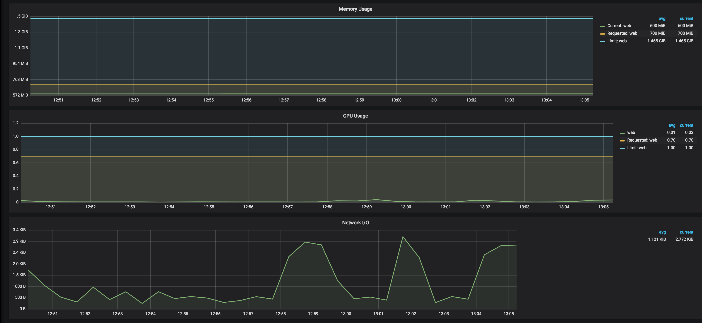
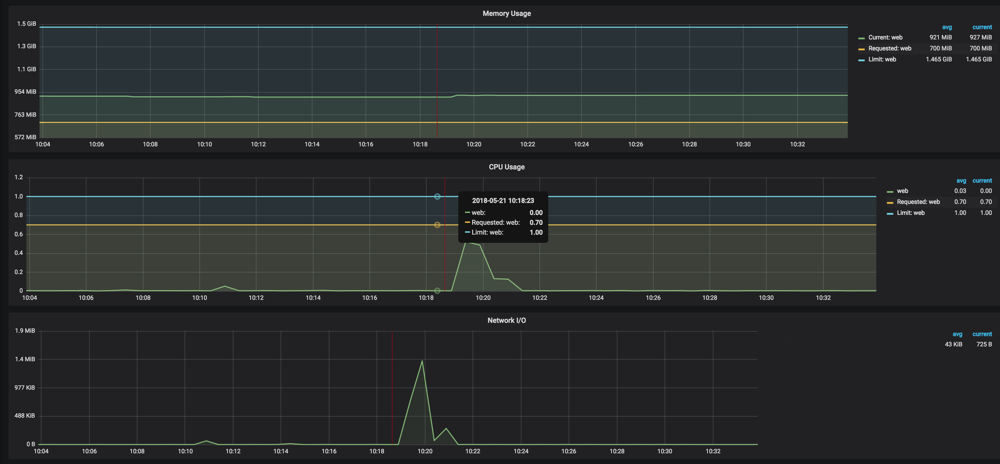

# load-testing

A collection of best practices, workflows, scripts and scenarios that Cloud Posse uses for load and performance testing of websites and applications (in particular those deployed on Kubernetes clusters).

__NOTE:__ All load testing scenarios in [scenarios](scenarios) are just examples and are provided here for reference.
Consider updating them to reflect your environment.


## Introduction

For load and performance testing, the workflow consists of these main steps:

1. [Select and configure load testing tools](#select-and-configure-load-testing-tools)
2. [Implement load testing scenarios and scripts](#implement-load-testing-scenarios-and-scripts)
3. [Perform load testing and analyze the results](#perform-load-testing-and-analyze-the-results)
4. [Suggest improvements and tuning procedures for the infrastructure and application under test](#suggest-improvements-and-tuning-procedures-for-the-infrastructure-and-application-under-test)


## Select and configure load testing tools

We use [k6](https://github.com/loadimpact/k6) from [Load Impact](https://loadimpact.com/) for the following reasons:

* **Open Source** - well documented (see [docs](https://docs.k6.io/docs)) and with simple command line usage
* **Synthetic Testing** - allows to easily create load test scenarios based on virtual users and simulated traffic configurations
* **Small Footprint** - implemented in [Go](https://golang.org/), which has excellent support for concurrency and small memory footprint
* **JavaScript DSL** - scenario scripting in `JavaScript` ES2015/ES6 with support for local and remote modules
* **Testing as Code** - test logic and configuration options are both in JS for version control friendliness
* **Command-line Driven** - can be run from the command line with command & control through CLI
* **Compatible with [HAR](http://www.softwareishard.com/blog/har-12-spec/)** - has a built-in [HAR](http://www.softwareishard.com/blog/har-12-spec/) converter that will read HAR files and convert them to `k6` scripts (see [session recording](https://docs.k6.io/docs/session-recording-har-support))
* **Automated Testing** - can be easily integrated into CI/CD pipelines
* **Comprehensive Metrics** - provides a comprehensive set of built-in [metrics](https://docs.k6.io/docs/result-metrics)
* **Beautiful Visualizations** - can stream metrics into [InfluxDB](https://www.influxdata.com/) for storage and visualization with [Grafana](https://grafana.com/) (see [influxdb-grafana](https://docs.k6.io/docs/influxdb-grafana))

Read more about k6's features and metrics:

* [Features](https://docs.k6.io/docs/welcome#section-features)
* [Interpret test results](http://support.loadimpact.com/knowledgebase/articles/174121-how-do-i-interpret-test-results)


### Installation

The [docker-compose](docker-compose.yml) file builds three Docker images:

* [InfluxDB](https://www.influxdata.com/)
* [Grafana](https://grafana.com/)
* [k6](https://github.com/loadimpact/k6)

Run [docker-compose up](https://docs.docker.com/compose/reference/up/) to build the containers and run `InfluxDB` and `Grafana` in the background

```sh
docker-compose up -d influxdb grafana
```

Open http://localhost:3000 to see `Grafana` running.

By default, `Grafana` does not come with any pre-configured dashboards.

We will install this dashboard to visualize `k6` metrics https://grafana.com/dashboards/2587

Go to `+/Import` menu and paste `https://grafana.com/dashboards/2587` URL into the `Grafana.com Dashboard` field, then click `Load` button.
Then select `myinfluxdb` from the `Select a InfluxDB data source` dropdown and click `Import`.

###


###


## Implement load testing scenarios and scripts

To establish a baseline, first we'll load test the website's home page with one concurrent user.

This will allow us to see the best performing numbers, against which we'd compare more advanced scenarios involving more pages and more concurrent users.

(see [scenario_01](scenarios/scenario_01.js))

```js
import http from "k6/http";
import {check} from "k6";
import {config} from "./utils.js";

export function setup() {
}

export function teardown(data) {
}

export default function (data) {
    let res = http.get(config.baseUrl);
    check(res, {"status is 200": (r) => r.status === 200});
}
```

Run the test

```sh
docker-compose run -v $PWD/scenarios:/scenarios k6 run --vus 1 /scenarios/scenario_01.js
```

```sh
execution: local
     output: influxdb=http://influxdb:8086/k6 (http://influxdb:8086)
     script: /scenarios/scenario_01.js

    duration: -,  iterations: 1
         vus: 1, max: 1

    done [==========================================================] 1 / 1

    ✓ status is 200

    checks.....................: 100.00% ✓ 1   ✗ 0
    data_received..............: 21 kB   29 kB/s
    data_sent..................: 628 B   864 B/s
    http_req_blocked...........: avg=507.78ms min=507.78ms med=507.78ms max=507.78ms p(90)=507.78ms p(95)=507.78ms
    http_req_connecting........: avg=101.94ms min=101.94ms med=101.94ms max=101.94ms p(90)=101.94ms p(95)=101.94ms
    http_req_duration..........: avg=218.25ms min=218.25ms med=218.25ms max=218.25ms p(90)=218.25ms p(95)=218.25ms
    http_req_receiving.........: avg=98.58ms  min=98.58ms  med=98.58ms  max=98.58ms  p(90)=98.58ms  p(95)=98.58ms
    http_req_sending...........: avg=311.79µs min=311.79µs med=311.79µs max=311.79µs p(90)=311.79µs p(95)=311.79µs
    http_req_tls_handshaking...: avg=233.84ms min=233.84ms med=233.84ms max=233.84ms p(90)=233.84ms p(95)=233.84ms
    http_req_waiting...........: avg=119.36ms min=119.36ms med=119.36ms max=119.36ms p(90)=119.36ms p(95)=119.36ms
    http_reqs..................: 1       1.377151/s
    iteration_duration.........: avg=726.16ms min=726.16ms med=726.16ms max=726.16ms p(90)=726.16ms p(95)=726.16ms
    iterations.................: 1       1.377151/s
    vus........................: 1       min=1 max=1
    vus_max....................: 1       min=1 max=1

```

Open the `Grafana` dashboard at http://localhost:3000 to see the load test results

###


###


We assume that we want the website to handle 50 concurrent users.

Let's hit the home page with 50 concurrent users, each doing one iteration

```sh
docker-compose run -v $PWD/scenarios:/scenarios k6 run --vus 50 -i 50 /scenarios/scenario_01.js
```

```sh
execution: local
     output: influxdb=http://influxdb:8086/k6 (http://influxdb:8086)
     script: /scenarios/scenario_01.js

    duration: -,   iterations: 50
         vus: 50, max: 50

    done [==========================================================] 50 / 50

    ✓ status is 200

    checks.....................: 100.00% ✓ 50   ✗ 0
    data_received..............: 1.1 MB  900 kB/s
    data_sent..................: 32 kB   26 kB/s
    http_req_blocked...........: avg=508.53ms min=367.91ms med=514.28ms max=626.1ms  p(90)=535.23ms p(95)=580.65ms
    http_req_connecting........: avg=118.73ms min=107.93ms med=116.3ms  max=128.63ms p(90)=127.72ms p(95)=128.27ms
    http_req_duration..........: avg=352.61ms min=242.46ms med=289.54ms max=693.7ms  p(90)=586.94ms p(95)=677.55ms
    http_req_receiving.........: avg=142.61ms min=106.13ms med=112.35ms max=325.64ms p(90)=221.21ms p(95)=243.53ms
    http_req_sending...........: avg=302.04µs min=96µs     med=216.3µs  max=1.47ms   p(90)=450.41µs p(95)=722.01µs
    http_req_tls_handshaking...: avg=384.43ms min=255.68ms med=392.95ms max=490.64ms p(90)=400.86ms p(95)=445.49ms
    http_req_waiting...........: avg=209.7ms  min=121.49ms med=178.65ms max=465.43ms p(90)=372.73ms p(95)=449.88ms
    http_reqs..................: 50      41.106944/s
    iteration_duration.........: avg=861.49ms min=613.3ms  med=821.16ms max=1.21s    p(90)=1.1s     p(95)=1.19s
    iterations.................: 50      41.106944/s
    vus........................: 50      min=50 max=50
    vus_max....................: 50      min=50 max=50

```

We just loaded the website with `41.106944` requests per second.

Let's increase the number of iterations to hit the home page with approximately 50 requests per second.

```sh
docker-compose run -v $PWD/scenarios:/scenarios k6 run --vus 50 -i 80 /scenarios/scenario_01.js
```

```sh
execution: local
     output: influxdb=http://influxdb:8086/k6 (http://influxdb:8086)
     script: /scenarios/scenario_01.js

    duration: -,   iterations: 80
         vus: 50, max: 50

    done [==========================================================] 80 / 80

    ✓ status is 200

    checks.....................: 100.00% ✓ 80   ✗ 0
    data_received..............: 1.6 MB  1.0 MB/s
    data_sent..................: 36 kB   23 kB/s
    http_req_blocked...........: avg=417.72ms min=0s       med=654.48ms max=773.72ms p(90)=752.66ms p(95)=755.02ms
    http_req_connecting........: avg=72.56ms  min=0s       med=109.63ms max=126.36ms p(90)=124.42ms p(95)=125.01ms
    http_req_duration..........: avg=365.54ms min=124.6ms  med=300.31ms max=798.99ms p(90)=675.51ms p(95)=767.64ms
    http_req_receiving.........: avg=189.48ms min=383.2µs  med=116.58ms max=572.32ms p(90)=357.2ms  p(95)=553.45ms
    http_req_sending...........: avg=171.3µs  min=56.4µs   med=156.7µs  max=557.4µs  p(90)=303.64µs p(95)=366.13µs
    http_req_tls_handshaking...: avg=220.24ms min=0s       med=344.77ms max=446.4ms  p(90)=427.9ms  p(95)=429.37ms
    http_req_waiting...........: avg=175.89ms min=121.14ms med=148.49ms max=478.35ms p(90)=238.48ms p(95)=265.03ms
    http_reqs..................: 80      50.821139/s
    iteration_duration.........: avg=783.68ms min=124.91ms med=972.43ms max=1.55s    p(90)=1.23s    p(95)=1.36s
    iterations.................: 80      50.821139/s
    vus........................: 50      min=50 max=50
    vus_max....................: 50      min=50 max=50

```


Check the Kubernetes pods CPU and memory consumption in the Kubernetes `Grafana` dashboard

###



###


We can conclude that with the current CPU and memory configurations for Kubernetes pods, the site can handle 50 requests per second to the home page.


## Perform load testing and analyze the results

k6 has a built-in HAR converter that will read HAR files and convert them to k6 scripts that can then be executed.

See [session recording](https://docs.k6.io/docs/session-recording-har-support) for more details.

We recorded and prepared a sample scenario to test the complete user flow on a website, including signing up, creating a user profile, providing all required information, and finally getting a list of available options for the user (see [scenario_all](scenarios/scenario_all.js)).

Run it with a single user

```sh
docker-compose run -v $PWD/scenarios:/scenarios k6 run --vus 1 -i 1 /scenarios/scenario_all.js
```

```sh
execution: local
     output: influxdb=http://influxdb:8086/k6 (http://influxdb:8086)
     script: /scenarios/scenario_all.js

    duration: -,  iterations: 1
         vus: 1, max: 1

    done [==========================================================] 1 / 1

    █ page_01 - home

    █ page_02 - /profile

    █ page_03 - /save_profile

    █ page_04 - /add_categories

    █ page_05 - /add_features

    █ page_06 - /add_details

    █ page_07 - /add_details2

    █ page_08 - /users

    █ page_09 - /enrollment

    █ page_10 - /enrollment2

    █ page_11 - /update_profile

    data_received..............: 14 MB  630 kB/s
    data_sent..................: 234 kB 11 kB/s
    group_duration.............: avg=1.96s    min=106.14ms med=1.75s    max=4.91s    p(90)=3.76s    p(95)=4.34s
    http_req_blocked...........: avg=33.98ms  min=0s       med=0s       max=443.45ms p(90)=0s       p(95)=441.04ms
    http_req_connecting........: avg=7.36ms   min=0s       med=0s       max=96.85ms  p(90)=0s       p(95)=95.41ms
    http_req_duration..........: avg=227.61ms min=95.64ms  med=148.8ms  max=1.27s    p(90)=464.57ms p(95)=806.93ms
    http_req_receiving.........: avg=34.44ms  min=76.3µs   med=1.12ms   max=1.11s    p(90)=102.9ms  p(95)=117.98ms
    http_req_sending...........: avg=224.35µs min=83.5µs   med=178.1µs  max=1.45ms   p(90)=346.46µs p(95)=545.93µs
    http_req_tls_handshaking...: avg=17.26ms  min=0s       med=0s       max=225.33ms p(90)=0s       p(95)=224.26ms
    http_req_waiting...........: avg=192.94ms min=95.41ms  med=105.15ms max=998.45ms p(90)=374.83ms p(95)=652.32ms
    http_reqs..................: 130    6.027408/s
    iteration_duration.........: avg=21.56s   min=21.56s   med=21.56s   max=21.56s   p(90)=21.56s   p(95)=21.56s
    iterations.................: 1      0.046365/s
    vus........................: 1      min=1 max=1
    vus_max....................: 1      min=1 max=1

```

The entire process took 21 seconds.

Now run it with 50 concurrent users

```sh
docker-compose run -v $PWD/scenarios:/scenarios k6 run --vus 50 -i 50 /scenarios/scenario_all.js
```

```sh
execution: local
     output: influxdb=http://influxdb:8086/k6 (http://influxdb:8086)
     script: /scenarios/scenario_all.js

    duration: -,   iterations: 50
         vus: 50, max: 50

    done [==========================================================] 50 / 50

    █ page_01 - home

    █ page_02 - /profile

    █ page_03 - /save_profile

    █ page_04 - /add_categories

    █ page_05 - /add_features

    █ page_06 - /add_details

    █ page_07 - /add_details2

    █ page_08 - /users

    █ page_09 - /enrollment

    █ page_10 - /enrollment2

    █ page_11 - /update_profile

    data_received..............: 679 MB 6.6 MB/s
    data_sent..................: 12 MB  115 kB/s
    group_duration.............: avg=5.78s    min=104.4ms    med=3.02s    max=1m6s     p(90)=10.88s   p(95)=13.51s
    http_req_blocked...........: avg=230.04ms min=0s         med=0s       max=5.64s    p(90)=0s       p(95)=2.93s
    http_req_connecting........: avg=10.63ms  min=0s         med=0s       max=321.33ms p(90)=0s       p(95)=123.46ms
    http_req_duration..........: avg=953.25ms min=128.3µs    med=292.67ms max=59.93s   p(90)=2.22s    p(95)=3.19s
    http_req_receiving.........: avg=223.82ms min=-15.0602ms med=2.04ms   max=59.78s   p(90)=389.02ms p(95)=1.14s
    http_req_sending...........: avg=221.58µs min=70.8µs     med=155.4µs  max=8.2ms    p(90)=337µs    p(95)=469.13µs
    http_req_tls_handshaking...: avg=206.19ms min=0s         med=0s       max=5.24s    p(90)=0s       p(95)=2.59s
    http_req_waiting...........: avg=729.2ms  min=0s         med=199.58ms max=59.7s    p(90)=1.96s    p(95)=2.86s
    http_reqs..................: 6500   63.046647/s
    iteration_duration.........: avg=1m3s     min=31.83s     med=50.92s   max=1m43s    p(90)=1m39s    p(95)=1m40s
    iterations.................: 50     0.484974/s
    vus........................: 50     min=50 max=50
    vus_max....................: 50     min=50 max=50

```

Check the Kubernetes pods CPU and memory consumption in the Kubernetes `Grafana` dashboard

###



###

From the load test stats and graphs above, we can conclude that the provisioned CPU and memory resources on the Kubernetes cluster are enough to sustain 50 concurrent users going through the entire flow.


## Suggest improvements and tuning procedures for the infrastructure and application under test

Here are some optimization steps that we usually perform after running load tests:

* Put all static assets behind a CDN (e.g. AWS CloudFront), do not overload the Kubernetes pods with serving the static assets (in many cases, this is one of the main reasons of poor website performance)
* Scale Kubernetes cluster vertically by using different types of EC2 instances
* Scale Kubernetes cluster horizontally by adding nodes
* Scale Kubernetes pods horizontally by increasing the replica count
* Scale Kubernetes pods vertically by increasing CPU and Memory limits
* Scale Nginx Ingress pods horizontally by increasing the replica count
* Scale Nginx Ingress vertically by increasing CPU and Memory limits
* Tune Nginx parameters (e.g timeouts, queues)
* Optimize application/web server parameters (e.g. concurrency, threads and processes, thread pools, timeouts, memory limits)
* Optimize database queries and indexes


### Database indexes creation rules and best practices

The main rule is that with indexes, there are no absolute rules. Indexing is like a math problem. That said, rules help:

* Consider the cost of maintaining indexes - pick the most important queries and set up indexes for those first

* Retrieve less data (less bandwidth, less processing)

* Avoid point queries and point index lookup within range queries (make the indexes covering) - random access is slow, sequential access is fast

* Avoid sorting and grouping the result after query execution - indexes can help get rid of this

* Compound indexes on composite primary keys in many-to-many tables will only work for range queries if an equality check on the first column in the index is included in the query.
If the equality check on the first column in the index is not included in the query, the indexes are useless and only consume disk space and slow down writes.

* When creating compound indexes, follow these rules for queries combining equality tests, sort fields, and range filters:
    * Add fields in order from the highest selectivity to the lowest selectivity (if a field is not selective enough, do not add it to the index)
    * Equality tests - add all equality-tested fields to the compound index, in any order
    * Sort fields (ascending/descending only matters if there are multiple fields) - add sort fields to the index in the same order and direction as the query's sort
    * Range filters - first, add the range filter for the field with the lowest selectivity (fewest distinct values in the collection), then the next lowest-selectivity range filter, and so on to the highest-selectivity
    (this is counter-intuitive at first, but it allows the database to more effectively traverse different areas of B-Trees)


## Credits

Thanks to [Load Impact](https://loadimpact.com/) for the excellent [k6](https://github.com/loadimpact/k6) tool and [examples of load testing scenarios](https://github.com/loadimpact/k6/tree/master/samples)


## Help

**Got a question?**

File a GitHub [issue](https://github.com/cloudposse/load-testing/issues), send us an [email](mailto:hello@cloudposse.com) or reach out to us on [Gitter](https://gitter.im/cloudposse/).


## Contributing

### Bug Reports & Feature Requests

Please use the [issue tracker](https://github.com/cloudposse/load-testing/issues) to report any bugs or file feature requests.

### Developing

If you are interested in being a contributor and want to get involved in developing `load-testing`, we would love to hear from you! Shoot us an [email](mailto:hello@cloudposse.com).

In general, PRs are welcome. We follow the typical "fork-and-pull" Git workflow.

 1. **Fork** the repo on GitHub
 2. **Clone** the project to your own machine
 3. **Commit** changes to your own branch
 4. **Push** your work back up to your fork
 5. Submit a **Pull request** so that we can review your changes

**NOTE:** Be sure to merge the latest from "upstream" before making a pull request!


## License

[APACHE 2.0](LICENSE) © 2018 [Cloud Posse, LLC](https://cloudposse.com)

See [LICENSE](LICENSE) for full details.

    Licensed to the Apache Software Foundation (ASF) under one
    or more contributor license agreements.  See the NOTICE file
    distributed with this work for additional information
    regarding copyright ownership.  The ASF licenses this file
    to you under the Apache License, Version 2.0 (the
    "License"); you may not use this file except in compliance
    with the License.  You may obtain a copy of the License at

      http://www.apache.org/licenses/LICENSE-2.0

    Unless required by applicable law or agreed to in writing,
    software distributed under the License is distributed on an
    "AS IS" BASIS, WITHOUT WARRANTIES OR CONDITIONS OF ANY
    KIND, either express or implied.  See the License for the
    specific language governing permissions and limitations
    under the License.


## About

`load-testing` is maintained and funded by [Cloud Posse, LLC][website].


Like it? Please let us know at <hello@cloudposse.com>

We love [Open Source Software](https://github.com/cloudposse/)!

See [our other projects][community]
or [hire us][hire] to help build your next cloud platform.

  [website]: https://cloudposse.com/
  [community]: https://github.com/cloudposse/
  [hire]: https://cloudposse.com/contact/


## Contributors

| [![Erik Osterman][erik_img]][erik_web]<br/>[Erik Osterman][erik_web] | [![Andriy Knysh][andriy_img]][andriy_web]<br/>[Andriy Knysh][andriy_web] |[![Igor Rodionov][igor_img]][igor_web]<br/>[Igor Rodionov][igor_img]|[![Sarkis Varozian][sarkis_img]][sarkis_web]<br/>[Sarkis Varozian][sarkis_web] |
|-------------------------------------------------------|------------------------------------------------------------------|------------------------------------------------------------------|------------------------------------------------------------------|

[erik_img]: http://s.gravatar.com/avatar/88c480d4f73b813904e00a5695a454cb?s=144
[erik_web]: https://github.com/osterman/
[andriy_img]: https://avatars0.githubusercontent.com/u/7356997?v=4&u=ed9ce1c9151d552d985bdf5546772e14ef7ab617&s=144
[andriy_web]: https://github.com/aknysh/
[igor_img]: http://s.gravatar.com/avatar/bc70834d32ed4517568a1feb0b9be7e2?s=144
[igor_web]: https://github.com/goruha/
[sarkis_img]: https://avatars3.githubusercontent.com/u/42673?s=144&v=4
[sarkis_web]: https://github.com/sarkis/
