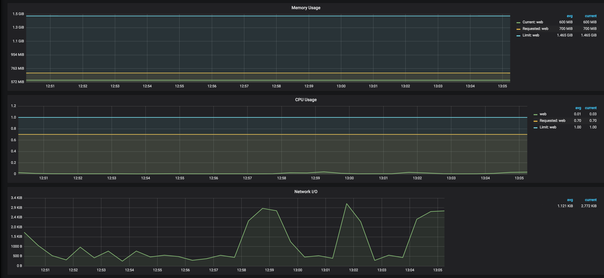

To establish a baseline, first we'll load test the website's home page with one concurrent user.

This will allow us to see the best performing numbers, against which we'd compare more advanced scenarious involving more pages and more concurrent users.

(see [scenario_01](../scenarios/scenario_01.js))

```js
import http from "k6/http";
import {check} from "k6";
import {config} from "./utils.js";

export function setup() {
    console.log("Options: " + JSON.stringify(options) + "\n");
}

export function teardown(data) {
}

export default function (data) {
    let res = http.get(config.baseUrl);
    check(res, {"status is 200": (r) => r.status === 200});
}
```

Run the test

```sh
docker-compose run -v $PWD/scenarios:/scenarios k6 run --vus 1 /scenarios/scenario_01.js
```

```
execution: local
     output: influxdb=http://influxdb:8086/k6 (http://influxdb:8086)
     script: /scenarios/scenario_01.js

    duration: -,  iterations: 1
         vus: 1, max: 1

    done [==========================================================] 1 / 1

    ✓ status is 200

    checks.....................: 100.00% ✓ 1   ✗ 0
    data_received..............: 21 kB   29 kB/s
    data_sent..................: 628 B   864 B/s
    http_req_blocked...........: avg=507.78ms min=507.78ms med=507.78ms max=507.78ms p(90)=507.78ms p(95)=507.78ms
    http_req_connecting........: avg=101.94ms min=101.94ms med=101.94ms max=101.94ms p(90)=101.94ms p(95)=101.94ms
    http_req_duration..........: avg=218.25ms min=218.25ms med=218.25ms max=218.25ms p(90)=218.25ms p(95)=218.25ms
    http_req_receiving.........: avg=98.58ms  min=98.58ms  med=98.58ms  max=98.58ms  p(90)=98.58ms  p(95)=98.58ms
    http_req_sending...........: avg=311.79µs min=311.79µs med=311.79µs max=311.79µs p(90)=311.79µs p(95)=311.79µs
    http_req_tls_handshaking...: avg=233.84ms min=233.84ms med=233.84ms max=233.84ms p(90)=233.84ms p(95)=233.84ms
    http_req_waiting...........: avg=119.36ms min=119.36ms med=119.36ms max=119.36ms p(90)=119.36ms p(95)=119.36ms
    http_reqs..................: 1       1.377151/s
    iteration_duration.........: avg=726.16ms min=726.16ms med=726.16ms max=726.16ms p(90)=726.16ms p(95)=726.16ms
    iterations.................: 1       1.377151/s
    vus........................: 1       min=1 max=1
    vus_max....................: 1       min=1 max=1

```

Open the `Grafana` dashboard at http://localhost:3000 to see the load test results

###


###


We assume that we want the website to handle 50 concurrent users.

Let's hit the home page with 50 concurrent users, each doing one iteration

```sh
docker-compose run -v $PWD/scenarios:/scenarios k6 run --vus 50 -i 50 /scenarios/scenario_01.js
```

```
execution: local
     output: influxdb=http://influxdb:8086/k6 (http://influxdb:8086)
     script: /scenarios/scenario_01.js

    duration: -,   iterations: 50
         vus: 50, max: 50

    done [==========================================================] 50 / 50

    ✓ status is 200

    checks.....................: 100.00% ✓ 50   ✗ 0
    data_received..............: 1.1 MB  900 kB/s
    data_sent..................: 32 kB   26 kB/s
    http_req_blocked...........: avg=508.53ms min=367.91ms med=514.28ms max=626.1ms  p(90)=535.23ms p(95)=580.65ms
    http_req_connecting........: avg=118.73ms min=107.93ms med=116.3ms  max=128.63ms p(90)=127.72ms p(95)=128.27ms
    http_req_duration..........: avg=352.61ms min=242.46ms med=289.54ms max=693.7ms  p(90)=586.94ms p(95)=677.55ms
    http_req_receiving.........: avg=142.61ms min=106.13ms med=112.35ms max=325.64ms p(90)=221.21ms p(95)=243.53ms
    http_req_sending...........: avg=302.04µs min=96µs     med=216.3µs  max=1.47ms   p(90)=450.41µs p(95)=722.01µs
    http_req_tls_handshaking...: avg=384.43ms min=255.68ms med=392.95ms max=490.64ms p(90)=400.86ms p(95)=445.49ms
    http_req_waiting...........: avg=209.7ms  min=121.49ms med=178.65ms max=465.43ms p(90)=372.73ms p(95)=449.88ms
    http_reqs..................: 50      41.106944/s
    iteration_duration.........: avg=861.49ms min=613.3ms  med=821.16ms max=1.21s    p(90)=1.1s     p(95)=1.19s
    iterations.................: 50      41.106944/s
    vus........................: 50      min=50 max=50
    vus_max....................: 50      min=50 max=50

```

We just loaded the website with `41.106944` requests per second.

Let's increase the number of iterations to hit the home page with approximately 50 requests per second.

```sh
docker-compose run -v $PWD/scenarios:/scenarios k6 run --vus 50 -i 80 /scenarios/scenario_01.js
```

```
execution: local
     output: influxdb=http://influxdb:8086/k6 (http://influxdb:8086)
     script: /scenarios/scenario_01.js

    duration: -,   iterations: 80
         vus: 50, max: 50

    done [==========================================================] 80 / 80

    ✓ status is 200

    checks.....................: 100.00% ✓ 80   ✗ 0
    data_received..............: 1.6 MB  1.0 MB/s
    data_sent..................: 36 kB   23 kB/s
    http_req_blocked...........: avg=417.72ms min=0s       med=654.48ms max=773.72ms p(90)=752.66ms p(95)=755.02ms
    http_req_connecting........: avg=72.56ms  min=0s       med=109.63ms max=126.36ms p(90)=124.42ms p(95)=125.01ms
    http_req_duration..........: avg=365.54ms min=124.6ms  med=300.31ms max=798.99ms p(90)=675.51ms p(95)=767.64ms
    http_req_receiving.........: avg=189.48ms min=383.2µs  med=116.58ms max=572.32ms p(90)=357.2ms  p(95)=553.45ms
    http_req_sending...........: avg=171.3µs  min=56.4µs   med=156.7µs  max=557.4µs  p(90)=303.64µs p(95)=366.13µs
    http_req_tls_handshaking...: avg=220.24ms min=0s       med=344.77ms max=446.4ms  p(90)=427.9ms  p(95)=429.37ms
    http_req_waiting...........: avg=175.89ms min=121.14ms med=148.49ms max=478.35ms p(90)=238.48ms p(95)=265.03ms
    http_reqs..................: 80      50.821139/s
    iteration_duration.........: avg=783.68ms min=124.91ms med=972.43ms max=1.55s    p(90)=1.23s    p(95)=1.36s
    iterations.................: 80      50.821139/s
    vus........................: 50      min=50 max=50
    vus_max....................: 50      min=50 max=50

```


Check the Kubernetes pods CPU and memory consumption in the Kubernetes `Grafana` dashboard

###



###


We can conclude that with the current CPU and memory configurations for Kubernetes pods, the site can handle 50 requests per second to the home page.
